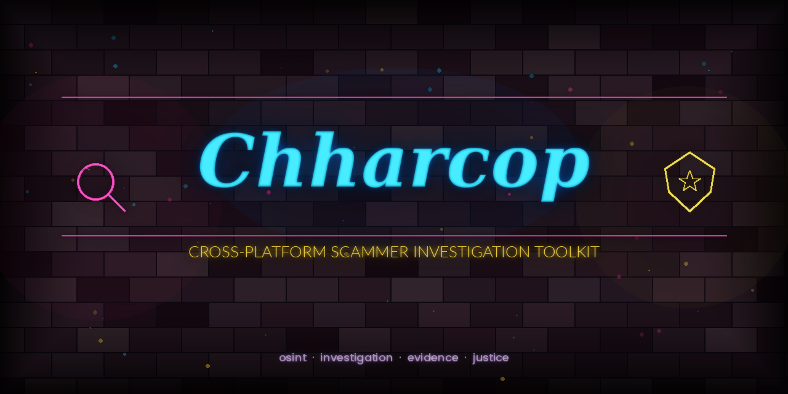

<p align="center">
  
</p>

<h1 align="center">Chharcop</h1>

<p align="center">
  <strong>Cross-platform scammer investigation toolkit</strong>
</p>

<p align="center">
  <a href="https://github.com/chharith/chharcop/stargazers"></a>
  <a href="https://github.com/chharith/chharcop/blob/main/LICENSE"></a>
  <a href="https://www.python.org/"></a>
  <a href="https://github.com/chharith/chharcop/commits/main"></a>
  <a href="https://github.com/chharith/chharcop/issues"></a>
  <a href="https://github.com/chharith/chharcop/pulls"></a>
</p>

<br />

<p align="center">
  <em>Arm yourself with the tools investigators actually need. Chharcop automates OSINT collection, evidence preservation, and report generation across web platforms, gaming networks, and communication channels — all from a single CLI.</em>
</p>

---

## Why Chharcop?

Online scams cost victims billions every year and operate across dozens of platforms simultaneously. Traditional tools force investigators to juggle separate scripts, browser extensions, and manual screenshots. Chharcop unifies the entire workflow — from initial lead to court-ready evidence package — into one cross-platform toolkit that runs on Windows, macOS, and Linux.

---

## Feature Highlights

**Automated OSINT Collection** — Pull public records, social profiles, domain WHOIS, and reverse image results in a single sweep. No manual tab-hopping required.

**Evidence-Grade Capture** — Every piece of data is hashed (SHA-256), timestamped, and stored in a tamper-evident chain-of-custody format that holds up under legal scrutiny.

**Cross-Platform Reach** — Investigate across web marketplaces, social media, gaming platforms (Steam, Discord, Xbox Live), and communication apps from one unified interface.

**Smart Report Generation** — Automatically compile findings into professional PDF/DOCX investigation reports with timelines, entity graphs, and evidence indexes.

**Plugin Architecture** — Extend Chharcop with community modules or write your own. Drop a Python file into `plugins/` and it's live.

**Privacy-First Design** — All data stays local. No cloud dependencies, no telemetry, no third-party data sharing. Your investigations remain yours.

---

## Quick Start

### Prerequisites

- Python 3.10 or higher
- pip (included with Python)
- Git

### Installation

```bash
# Clone the repository
git clone https://github.com/chharith/chharcop.git
cd chharcop

# Create a virtual environment (recommended)
python -m venv .venv
source .venv/bin/activate        # Linux / macOS
.venv\Scripts\activate           # Windows

# Install dependencies
pip install -r requirements.txt

# Verify installation
chharcop --version
```

### One-Liner (pip)

```bash
pip install chharcop
```

---

## CLI Usage

```bash
# Run a full investigation sweep on a username
chharcop investigate --target "scammer_username" --modules all

# Web-only OSINT lookup
chharcop web --username "scammer_username" --depth full

# Gaming platform investigation
chharcop gaming --platform steam --id "76561198000000000"

# Capture and hash a webpage as evidence
chharcop evidence capture --url "https://example.com/listing" --format png+html

# Generate a PDF investigation report
chharcop report generate --case "CASE-2026-0042" --format pdf

# Search across all collected evidence
chharcop evidence search --query "bitcoin wallet" --case "CASE-2026-0042"

# Watch a target for new activity (runs in background)
chharcop monitor --target "scammer_username" --interval 30m --notify slack
```

---

## Module Overview

### `web` — Web & Social OSINT

Username enumeration across 300+ platforms, domain/IP intelligence, WHOIS history, reverse image search, social media timeline archival, and dark web mention scanning.

```bash
chharcop web --username "target" --platforms all --output json
```

### `gaming` — Gaming Platform Investigations

Profile scraping for Steam, Discord, Xbox Live, PSN, and Epic Games. Tracks name history, friend networks, trade histories, and linked accounts.

```bash
chharcop gaming --platform discord --id "123456789" --depth full
```

### `evidence` — Evidence Preservation

Forensic-grade webpage capture (full DOM + screenshot), file hashing with SHA-256 chain, metadata extraction, EXIF analysis, and tamper-evident storage with chain-of-custody logging.

```bash
chharcop evidence capture --url "https://scam-site.example" --hash sha256
```

### `report` — Report Generation

Compile all findings into professional investigation reports. Supports PDF, DOCX, and HTML output with auto-generated timelines, entity relationship graphs, communication maps, and evidence appendices.

```bash
chharcop report generate --case "CASE-2026-0042" --template law-enforcement
```

---

## Project Structure

```
chharcop/
├── cli/                 # CLI entry point and argument parsing
├── modules/
│   ├── web/             # Web OSINT collection engines
│   ├── gaming/          # Gaming platform investigators
│   ├── evidence/        # Capture, hashing, and storage
│   └── report/          # Report generation templates
├── plugins/             # Community and custom plugins
├── core/
│   ├── config.py        # Configuration management
│   ├── database.py      # Local SQLite evidence store
│   ├── hasher.py        # SHA-256 chain-of-custody
│   └── scheduler.py     # Background monitoring tasks
├── templates/           # Report templates (PDF, DOCX, HTML)
├── tests/               # Test suite
├── requirements.txt
├── setup.py
└── README.md
```

---

## Configuration

Chharcop uses a local `config.yaml` for API keys and preferences:

```yaml
# ~/.chharcop/config.yaml
general:
  default_output: ./investigations
  log_level: info

api_keys:
  shodan: "your-key-here"
  virustotal: "your-key-here"
  dehashed: "your-key-here"

notifications:
  slack_webhook: "https://hooks.slack.com/..."
  discord_webhook: "https://discord.com/api/webhooks/..."
```

---

## Contributing

Contributions are what make open-source great. Whether it's a bug fix, a new module, or documentation improvements — all contributions are welcome.

1. **Fork** the repository
2. **Create** your feature branch (`git checkout -b feature/amazing-module`)
3. **Commit** your changes (`git commit -m 'Add amazing module'`)
4. **Push** to the branch (`git push origin feature/amazing-module`)
5. **Open** a Pull Request

Please read the [Contributing Guide](CONTRIBUTING.md) for details on our code of conduct and development workflow.

---

## Roadmap

- [ ] Browser extension for one-click evidence capture
- [ ] Cryptocurrency wallet tracing module
- [ ] AI-powered scam pattern detection
- [ ] Multi-language report templates
- [ ] REST API server mode
- [ ] Mobile app companion (React Native)

---

## Community & Support

<p align="center">
  <a href="https://github.com/chharith/chharcop/discussions"></a>
  <a href="https://discord.gg/chharcop"></a>
  <a href="https://twitter.com/chharcop"></a>
</p>

- **Bug Reports** — [Open an issue](https://github.com/chharith/chharcop/issues/new?template=bug_report.md)
- **Feature Requests** — [Start a discussion](https://github.com/chharith/chharcop/discussions/new?category=ideas)
- **Security Issues** — Email `security@chharcop.dev` (do not open a public issue)

---

## License

Distributed under the **MIT License**. See [`LICENSE`](LICENSE) for more information.

---

<p align="center">
  <sub>Built with conviction by <a href="https://github.com/chharith">@chharith</a> — because scammers shouldn't sleep easy.</sub>
</p>
